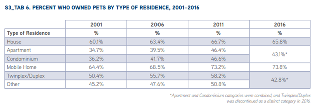
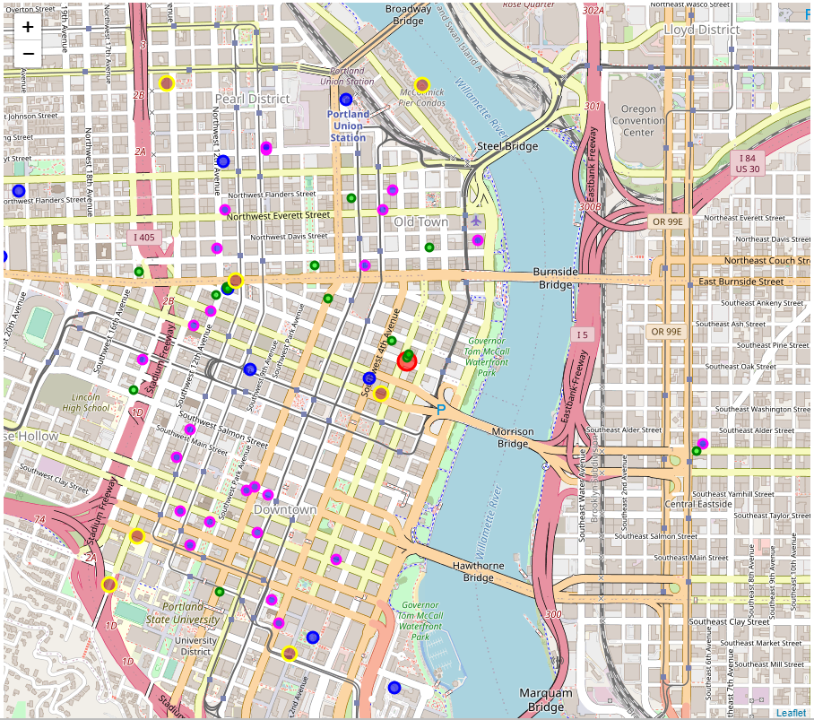
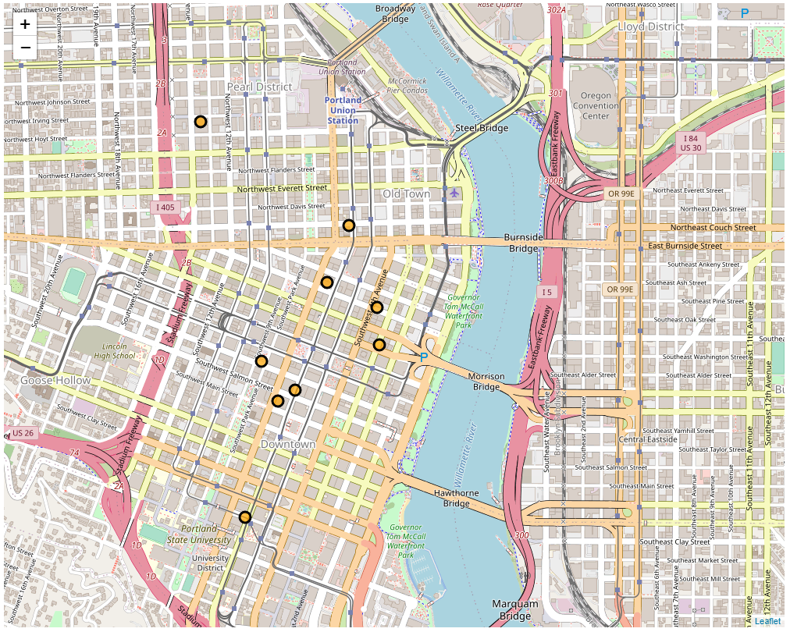

Student: DL, Coursera
IBM Data Science Capstone
February 7, 2021

# Introduction

## Background
Pet services are increasing in demand in large metropolitan cities as pet ownership increases overall nationwide.  The highest percentage of pet owners live in houses at 65.8%, but an impressive 43.1% live in apartments and condominiums, according to the 2016 study AVMA Pet Ownership and Demographics 2017-2018 Edition, published by the American Veterinary Medical Association.

[Source](https://www.avma.org/) free download with guest registration

Since apartments have limited yard areas, owners are dependent on walking their dogs themselves, or hiring a pet sitter, i.e. dog walker, to care for their pets during their working hours.  I created a fictional client, Paw & Claw, who is looking to expand their pet services into the city of Portland, OR, to explore a scenario involving finding a new business location.

## Problem

Paw & Claw wants to know: What is the ideal location intersecting near apartments, pet supply stores, trails, and grocery stores that does not have existing pet services (competitors)?  Next, they want to know if there are travel agencies in the area, as they often partner with travel businesses to cross market services.  Their business model caters to apartment dwellers and require that the new location be near the densest area of apartments.

## Interest

The interest is from Paw & Claw to help make a business decision on expanding to a new city to fill a need, revealed by lack of existing pet services, where favorable data points are present.  The financial impact of the Travel Agencies data will help determine if their clients travel extensively, they may choose to have a larger facility, and financial cost, to accommodate boarding pets.

## Data acquisition and cleaning

### Data Sources
The data source is Foursquare categories (venues), accessed via API.

### Data Cleaning
Data was cleaned by dropping unnecessary rows, removing empty cells, and sorting and grouping.  The Foursquare search results returned fine quality for Apartments, but Pet required extensive cleaning as it captured completely unrelated venues.  Grocery, Trail, and Travel also returned decent quality search results.  

One disappointment was the lack of Tips available for the Travel category.  I had planned to find ratings for the travel agencies from Foursquare, but not one had a rating.  I then signed up for a Google developer account because I had performed a web search for ‘travel agencies near portland state university’ which showed clearly there were reviews on Google Places, but had technical issues trying to install gmaps within the Lab.

## Feature selection
The features I focused on were Venue name, radius, distance, and Categories.

## Exploratory Data Analysis

### Relationships

The relationship I concerned my analysis on was finding the optimum location from: 

Apartments, Pets, Trail, and Grocery

After creating dataframes for the categories, and cleaning, I rendered a Folium map showing all four categories within a 1-mile radius of downtown.  The Pet search category has 2-mile radius, to cast a wider net and capture all pet related services.

The map proves a great visualization for understand the density of the 4 categories and I can easily see west of downtown is a high occurrence of Apartments, my priority data point.  Zooming in, I notice there is a university campus for Portland State University.  

To the south is a dog run and park, and there are several small block parks surrounding and running through the campus.  The waterway to the east boasts a major trail which courses throughout the city for quite a distance.

It’s interesting there are not many pet related venues in the area, which on the surface would seem like a good thing for Paw & Claw, but I suspect there is a reason which I will discuss at the conclusion of this report.

### Map of Apartments, Pet related services and goods, Grocery Stores and Trails

Figure 1 Venues map showing Apartments (magenta), Pet stores (blue), Grocery Stores (green), Trails (brown)

Next I looked at Travel search query, to find Travel related agencies and services.  I was surprised to find 8 travel venues within a 1-mile radius of downtown center.  This certainly seems like a dense amount of travel agencies for a small radius.  I estimate that the university students and staff must travel extensively, and Portland is known to be a very international city.

### Map of Travel Services

Figure 2 Travel agencies venues and related services

## Results and Discussion

My analysis shows that there is high density of apartments and condos around in the Portland State University are to the west of the city center point likely due to a student and faculty population. Additionally there are trails and parks nearby to walk pets. There are several smaller groceries and convenience stores north of campus, with larger stores central downtown. There are travel related services present that serve the student population and nearby downtown. There are no other Pet Services potentially competing with Paw & Claw in the one mile radius, according to Foursquare's data.

A challenge for Paw & Claw would be a lack of available real estate. A web search for available commercial property turned up few results.  This may also be a current reason why there are not many pet services present – the real estate may be too costly.

## Conclusion

What is the ideal location intersecting near pet supply stores, and parks, with current limited existing Pet Services?

I reviewed the map points to determine ideal location zip codes 97201,97205, 97204, 97209 are the best prospects. There is a dog park and dog run near the waterfront just east of campus in zip code 97201 and this is the optimimum location, with two small parks in between and a major trail along the waterfront.

There are 8 travel agencies, and specialty services such as passport, currency exchange, and hip travel hubs like a Segway rental and ride shares, to support an international population. I highly recommend this area for Paw & Claw's expansion plans with consideration to real estate availability and planning. The density of travel agencies within 1 radius mile is dense and Paw & Claw should consider this a strong indicator on whether to add a boarding service to their new location.

